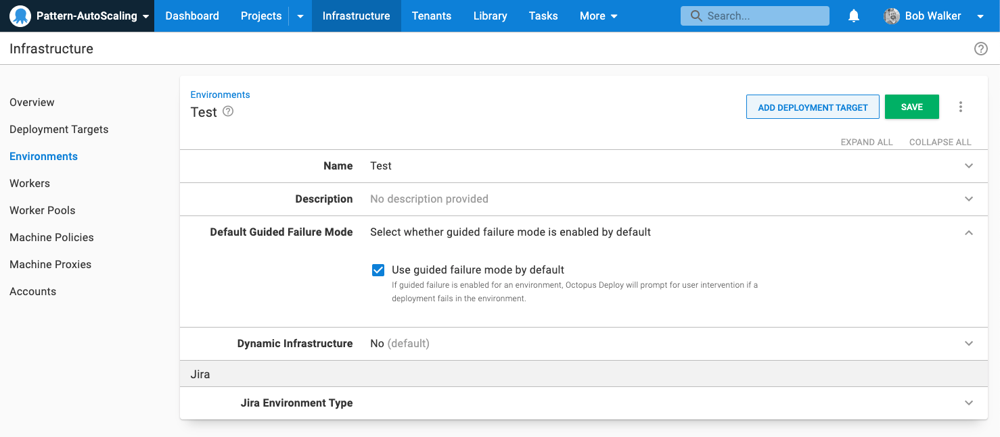

If you plan on using Octopus Deploy with auto scaling groups, there are some configuration changes you need to make in Octopus Deploy.

# Custom Machine Policy

Creating a custom machine can make it easier to handle scale out and scale in events.  The custom machine policy should:

Change the following settings from the default machine policy:

- Interval: 10 minutes
- During Health Checks: Unavailable deployment targets will not cause health checks to fail
- Calamari Updates: Always keep Calamari up to date
- Clean Up Unavailable Deployment Targets: Automatically delete unavailable machines after 15 minutes (optional)

When new machines are added a health check automatically kicks off.  That health check will verify the machine is running and Octopus can connect to it.  Setting Calamari to always be kept up to date means Calamari will be installed during that initial health check, which makes getting the new machine up and running faster.

Configuring the unavailable deployment targets will allow Octopus Deploy to clean up machines that have been removed due to a scale in event.  In a nutshell any machine that Octopus Deploy cannot find or connect to for 20 minutes will be removed.  This can be a bit of a blunt instrument for handling scale in events.  Please see the page on [scale in events](LINKTBD) for options on automatic deployment target removal.

# Project Settings

Any project that will deploy to auto-scaling virtual machines should have the deployment settings updated to:

- Deployment Targets Required: Allow deployments to be created when there are no deployment targets
- Unavailable Deployment Targets: Skip and Continue (specify a role)
- Unhealthy Deployment Targets: Exclude

Some auto-scaling technologies allow you to set the number of virtual machines to zero.  But you'll still need to deploy.  That is why the deployment targets required is set to allow deployments when there are no deployment targets.

The settings around unavailable and unhealthy deployment targets are there to handle when a scale-in event occurs.  If Octopus thinks a virtual machine still exists, but it has been deleted in the auto-scaling group, then you'll need to be able to skip them. 

# Guided Failure

A deployment will fail when a deployment target is removed while running a step on it.  That will happen during a scale-in event.  The chances of a scale-in event occuring during a deployment while deploying to a specific machine is small, but it is better to be prepared.  The recommendation is to configure [guided failure mode](docs/releases/guided-failures.md).  Any errors will pause the deployment and ask for user intervention.  From there you can exclude the deployment target or stop the deployment.

Guided failure mode can be configured at the environment level.

Or, at the project level.
