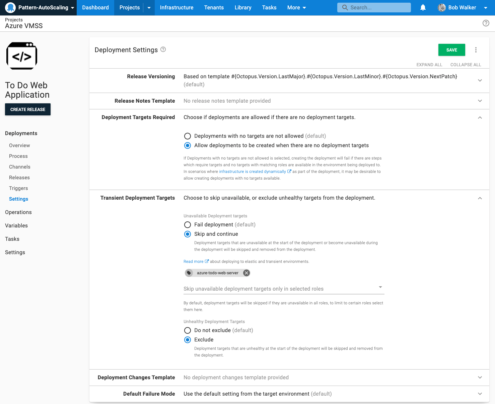

If you plan on using Octopus Deploy with auto scaling groups, there are some configuration changes you need to make in Octopus Deploy.

# Custom Machine Policy

Create a custom machine policy to be used for deployment targets in Virtual Machine Scale Sets.  Change the following settings from the default machine policy:

- Interval: 10 minutes
- During Health Checks: Unavailable deployment targets will not cause health checks to fail
- Calamari Updates: Always keep Calamari up to date
- Clean Up Unavailable Deployment Targets: Automatically delete unavailable machines after 15 minutes

These settings make it easier for Octopus Deploy to handle VMSS scale out and scale in events.  The interval and handling of unavailable deployment targets will allow Octopus Deploy to clean up machines that have been removed due to a scale in event.  In a nutshell, if a machine is removed and Octopus can't find it, it will be removed after 20 minutes.

When new machines are added a health check automatically kicks off.  That health check will verify the machine can be connected to and the state of the tentacle.  Setting Calamari to always be kept up to date means Calamari will be installed during that initial health check, which makes getting the new machine up and running faster.

# Project Settings

Any project that will deploy to virtual machines in a Virtual Machine Scale Set should be configured to:

- Deployment Targets Required: Allow deployments to be created when there are no deployment targets
- Unavailable Deployment Targets: Skip and Continue (specify a role)
- Unhealthy Deployment Targets: Exclude (in the event the machine policy hasn't removed the server yet)

A deployment will fail when a deployment target is removed while running a step on it.  The recommendation is to configure [guided failure mode](docs/releases/guided-failures.md).  Any errors will pause the deployment and ask for user intervention.

Guided failure mode can be configured at the environment level.

Or, at the project level.
